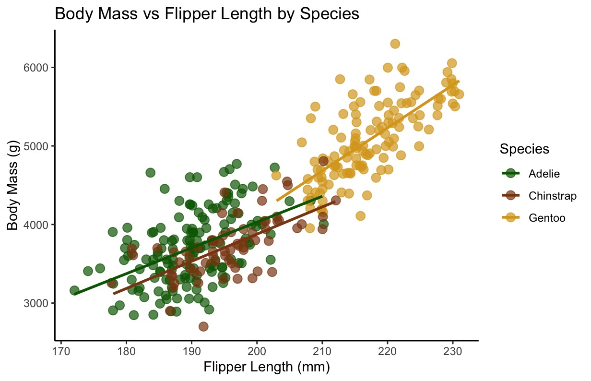

# MB5370 Programming Fundamentals
 
This repository contains coursework and practical exercises completed for MB5370 Techniques in Marine Science 1 at James Cook University.
 
## Learning Outcomes
 
Through this module I developed skills in:
- R Programming
- Git and GitHub
- Quarto
- Data Visualisation with ggplot2
- Reproducible Research
- Scientific Workflow Design
 
## Featured Visualisation
 
The figure below was produced during Workshop 2 using the Palmer Penguins dataset and demonstrates data visualisation techniques using ggplot2.
 
figures/Penguins_Figure.jpeg
=======

 
## Repository Structure
 
code/
R scripts from workshop activities
 
docs/
Rendered reports and Quarto files
 
figures/
Visualisations generated during workshops
 
data/
Supporting datasets
 
## Portfolio Website
 
https://sites.google.com/view/kendraporfolio